# SyllabusMCP - Distributed Architecture

[](https://www.python.org/downloads/)
[](https://fastapi.tiangolo.com/)
[](https://www.docker.com/)
[](https://modelcontextprotocol.io/)

**SyllabusMCP** is an educational project for **CMU 17-625 API Design** demonstrating a **distributed microservices architecture** using the Model Context Protocol (MCP). The system transforms academic syllabus processing into a scalable, containerized solution with HTTP-based communication between services.

## 🎯 Distributed Architecture Overview

This system demonstrates a **production-ready distributed architecture** that transforms a monolithic MCP application into scalable microservices. Key architectural achievements:

- **🐳 Containerized Microservices** - Each service runs in its own Docker container
- **🌐 HTTP-based Communication** - Services communicate via REST APIs
- **🚪 Unified MCP Gateway** - Single entry point for all distributed tools
- **⚖️ Load Balancing Ready** - Stateless services enable horizontal scaling
- **🔄 Service Independence** - Services can be deployed and scaled independently
- **🛡️ Type-safe APIs** - Pydantic models ensure data consistency across services
- **📊 Health Monitoring** - Built-in health checks for each service
- **🚀 Production Deploy** - Complete Docker Compose infrastructure

## 🏗️ Architecture Diagram

```mermaid
graph TB
    subgraph "Orchestration Layer"
        CLI1["orchestrator/run.py<br/>📋 Batch Processing"]
        CLI2["orchestrator/run_agent.py<br/>🤖 AI-Driven Workflow"]
    end
    
    subgraph "Registry Layer"
        REGISTRY["📚 Registry<br/>Service Discovery"]
        GATEWAY["🚪 MCP Gateway<br/>Unified Tool Interface<br/>14 Available Tools"]
    end
    
    subgraph "MCP Tool Layer" 
        WRAPPER1["📄 Syllabus Wrapper<br/>HTTP Client"]
        WRAPPER2["🎓 Academic Wrapper<br/>HTTP Client"]
        WRAPPER3["📅 Productivity Wrapper<br/>HTTP Client"]
    end
    
    subgraph "Service Layer - Docker Containers"
        SERVICE1["📄 Syllabus Service<br/>FastAPI :8001<br/>• parse_syllabus<br/>• answer_syllabus_question"]
        SERVICE2["🎓 Academic Planner<br/>FastAPI :8002<br/>• create_academic_plan<br/>• show_assignment_summary"]
        SERVICE3["📅 Productivity Service<br/>FastAPI :8003<br/>• Calendar Events CRUD<br/>• Reminders CRUD<br/>• Bulk Operations"]
    end
    
    CLI1 --> REGISTRY
    CLI2 --> REGISTRY
    REGISTRY --> GATEWAY
    GATEWAY --> WRAPPER1
    GATEWAY --> WRAPPER2
    GATEWAY --> WRAPPER3
    WRAPPER1 -->|HTTP POST :8001| SERVICE1
    WRAPPER2 -->|HTTP POST :8002| SERVICE2
    WRAPPER3 -->|HTTP POST :8003| SERVICE3
    
    classDef orchestration fill:#e1f5fe
    classDef integration fill:#f3e5f5
    classDef communication fill:#fff3e0
    classDef service fill:#e8f5e8
    
    class CLI1,CLI2 orchestration
    class REGISTRY,GATEWAY integration
    class WRAPPER1,WRAPPER2,WRAPPER3 communication
    class SERVICE1,SERVICE2,SERVICE3 service
```



## 🎯 Service Architecture

### 📄 Syllabus Service (Port 8001)
**Containerized PDF processing and AI-powered extraction**
- **Endpoints**: `/parse-syllabus`, `/answer-question`
- **Features**: PDF text extraction, GPT-powered parsing, Q&A
- **Timeouts**: 5min parsing, 2min questions (handles long LLM operations)
- **Dependencies**: pdfplumber, OpenAI API

### 🎓 Academic Planner Service (Port 8002)  
**Multi-course planning and analysis**
- **Endpoints**: `/create-plan`, `/assignment-summary`
- **Features**: Cross-course analysis, conflict detection, workload balancing
- **Timeouts**: 5min plan creation, 30sec summaries
- **AI Integration**: GPT-powered academic planning

### 📅 Productivity Service (Port 8003)
**Calendar and reminder management**
- **Endpoints**: 8 CRUD endpoints for events/reminders + bulk operations
- **Features**: Fast CRUD operations, bulk processing, formatted displays
- **Timeouts**: 30sec (optimized for speed)
- **Storage**: In-memory with structured models

### 🚪 MCP Gateway
**Unified tool interface**
- **Function**: Routes calls to appropriate services via HTTP
- **Tools Available**: 14 total tools across all services
- **Benefits**: Single import point, backward compatibility
- **Location**: `mcp_gateway/server.py`

## 🚀 Quick Start - Docker Deployment

The fastest way to run SyllabusMCP is using Docker Compose, which automatically starts all services:

### Prerequisites

- **Docker & Docker Compose** 
- **OpenAI API Key** (for AI-powered parsing)
- **PDF files or directories** (syllabi to process - supports individual files, directories, or mixed)

### 🐳 Docker Deployment (Recommended)

1. **Clone and setup**:
   ```bash
   git clone https://github.com/cmu-able/SyllabusMCP-distributed.git
   cd SyllabusMCP-distributed
   cp .env.example .env
   # Edit .env and add your OPENAI_API_KEY
   ```

2. **Start all services**:
   ```bash
   docker-compose up -d
   ```
   
   This starts:
   - 📄 Syllabus Service on port 8001
   - 🎓 Academic Planner on port 8002  
   - 📅 Productivity Service on port 8003
   - 💓 Health monitoring for all services

3. **Verify deployment**:
   ```bash
   docker-compose ps
   curl http://localhost:8001/health
   curl http://localhost:8002/health
   curl http://localhost:8003/health
   ```

### 💻 Local Development Setup

For development without Docker:

```bash
# Install dependencies
uv sync --extra dev

# Set environment
export OPENAI_API_KEY="your-api-key-here"

# Run services individually (3 separate terminals)
uv run python services/syllabus_service/app.py
uv run python services/academic_planner_service/app.py  
uv run python services/productivity_service/app.py
```

## 💬 Usage Examples

### Basic Academic Planning
```bash
# Traditional batch processing
uv run python orchestrator/run.py syllabus1.pdf syllabus2.pdf

# AI-driven workflow with custom goals
uv run python orchestrator/run_agent.py run \
  --prompt "Create calendar events and reminders for all assignments" \
  syllabus1.pdf syllabus2.pdf
```

### Natural Language Queries
```bash
# Ask questions about syllabi
uv run python orchestrator/run_agent.py run \
  --prompt "What are the attendance policies across all courses?" \
  course1.pdf course2.pdf

# Analyze workload across directory of syllabi
uv run python orchestrator/run_agent.py run \
  --prompt "Which weeks will be the busiest this semester?" \
  ../syllabus-pdfs

# Mix files and directories
uv run python orchestrator/run_agent.py run \
  --prompt "Compare assignment loads" \
  course1.pdf ../more-courses course2.pdf
```

### Tool Discovery
```bash
# List all 14 available tools
uv run python orchestrator/run_agent.py tools

# View specific tool schemas  
uv run python orchestrator/run_agent.py tools syllabus_server.parse_syllabus

# Show all tools from a service
uv run python orchestrator/run.py --list
```

### Service Interaction
```bash
# Direct API calls (when services are running)
curl -X POST "http://localhost:8001/parse-syllabus" \
  -H "Content-Type: application/json" \
  -d '{"pdf_path_or_url": "path/to/syllabus.pdf"}'

# Health check all services
curl http://localhost:8001/health && \
curl http://localhost:8002/health && \
curl http://localhost:8003/health
```

## 📊 Production Features

### 📈 Health Monitoring
```bash
# Check individual service health
curl http://localhost:8001/health  # Syllabus Service
curl http://localhost:8002/health  # Academic Planner  
curl http://localhost:8003/health  # Productivity Service

# All services respond with:
{"status": "healthy", "service": "service_name", "timestamp": "..."}
```

### 📊 Service Metrics
```bash
# View service logs
docker-compose logs syllabus-service
docker-compose logs academic-planner-service
docker-compose logs productivity-service

# Monitor resource usage
docker stats
```

### 🔄 Scaling Services
```bash
# Scale individual services
docker-compose up -d --scale syllabus-service=3
docker-compose up -d --scale productivity-service=2

# Services are stateless and can be horizontally scaled
```

## 🧪 Testing

Comprehensive testing across all layers:

```bash
# Test distributed services (requires services to be running)
uv run python -m pytest tests/test_syllabus_service.py -v

# Test orchestrator integration
uv run python -m pytest tests/test_executor.py -v

# Test individual components
uv run python -m pytest tests/ -v

# Test Docker deployment
docker-compose up -d
./scripts/test_services.sh  # If available
```

## 🛠️ Development

### Distributed Project Structure
```
├── services/                     # 🏢 Microservices (FastAPI)
│   ├── syllabus_service/         # PDF processing service :8001
│   │   ├── app.py               # FastAPI application
│   │   └── Dockerfile           # Container definition
│   ├── academic_planner_service/ # Planning service :8002
│   │   ├── app.py               # FastAPI application
│   │   └── Dockerfile           # Container definition
│   ├── productivity_service/     # CRUD service :8003
│   │   ├── app.py               # FastAPI application
│   │   └── Dockerfile           # Container definition
│   └── shared/
│       └── models.py            # 🏷️ Pydantic models
├── mcp_wrappers/                # 🌐 HTTP Client Layer
│   ├── syllabus/mcp_service.py   # HTTP wrapper
│   ├── academic_planner/mcp_service.py
│   └── productivity/mcp_service.py
├── mcp_gateway/                 # 🚪 Unified Gateway
│   └── server.py                # Single MCP interface
├── orchestrator/                # 🎭 Client Applications
│   ├── run.py                   # Batch processor
│   ├── run_agent.py             # AI-driven workflow
│   ├── shared.py                # Common utilities
│   └── executor.py              # Parallel execution
├── registry/                    # 📚 Service Discovery
│   └── __init__.py              # Tool registration
├── docker-compose.yml           # 🐳 Service Orchestration
├── .env.example                 # Environment template
└── DOCKER_DEPLOYMENT.md         # Deployment guide
```

### Adding New Microservices

1. **Create FastAPI Service**:
   ```bash
   mkdir services/new_service
   # Add app.py with FastAPI endpoints
   # Add Dockerfile
   ```

2. **Add HTTP Wrapper**:
   ```bash
   mkdir mcp_wrappers/new_service
   # Create mcp_service.py with HTTP client
   ```

3. **Update Gateway**:
   ```python
   # Add imports in mcp_gateway/server.py
   # Register tools with @mcp.tool() decorator
   ```

4. **Update Docker Compose**:
   ```yaml
   # Add service definition in docker-compose.yml
   # Include health checks and networking
   ```

## 🔧 Configuration

### Environment Variables (.env file)
```bash
# Required
OPENAI_API_KEY=your-openai-key-here

# Service URLs (automatically configured in Docker)
SYLLABUS_SERVICE_URL=http://syllabus-service:8001
ACADEMIC_PLANNER_SERVICE_URL=http://academic-planner-service:8002  
PRODUCTIVITY_SERVICE_URL=http://productivity-service:8003

# Optional: Service timeouts
SYLLABUS_TIMEOUT=300  # 5 minutes for parsing
ACADEMIC_TIMEOUT=300  # 5 minutes for planning
PRODUCTIVITY_TIMEOUT=30  # 30 seconds for CRUD
```

### Docker Configuration
- **Networking**: Services communicate via internal Docker network
- **Health Checks**: All services have `/health` endpoints
- **Volumes**: No persistent storage required (stateless services)
- **Ports**: 8001, 8002, 8003 exposed for external access

## 🎓 Educational Context - API Design Principles

This project demonstrates **advanced API design concepts** for **CMU 17-625**:

### 📚 Core Concepts Demonstrated
1. **🌐 Distributed Architecture** - Microservices with HTTP communication
2. **🎁 Service Decomposition** - Single responsibility per service
3. **🚪 API Gateway Pattern** - Unified interface to distributed services
4. **📊 Type Safety** - Pydantic models for data validation
5. **🔄 Horizontal Scaling** - Stateless service design
6. **💓 Observability** - Health checks and structured logging
7. **🚀 Containerization** - Production-ready deployment
8. **🛠️ Developer Experience** - Clear APIs, documentation, testing

### 💯 API Design Best Practices
- **RESTful Design** - Standard HTTP methods and status codes
- **Error Handling** - Consistent error responses across services
- **Versioning Strategy** - Prepared for API evolution
- **Documentation** - OpenAPI/Swagger for each service
- **Testing** - Comprehensive test coverage including integration tests
- **Security** - Input validation and proper error responses

## ⚠️ Production Considerations

### Security
- **API Keys**: Store OpenAI API key securely using environment variables
- **Network Security**: Services communicate via internal Docker network
- **Input Validation**: All endpoints validate input data using Pydantic models
- **Error Handling**: No sensitive information leaked in error responses

### Monitoring
- **Health Checks**: Each service exposes `/health` endpoint
- **Logging**: Structured logging for debugging and monitoring
- **Metrics**: Docker stats for resource monitoring
- **Alerting**: Can be integrated with monitoring solutions

### Costs & Limits
- **OpenAI API**: Monitor usage to control costs
- **Resource Usage**: Each service configured with appropriate memory/CPU limits
- **Rate Limiting**: Consider implementing rate limiting for production use

## 🚀 Deployment Options

### Local Development
```bash
docker-compose up -d
```

### Production Kubernetes
```bash
# Convert Docker Compose to Kubernetes manifests
kompose convert
kubectl apply -f .
```

### Cloud Deployment
- **AWS**: ECS/EKS with Application Load Balancer
- **GCP**: Cloud Run or GKE
- **Azure**: Container Instances or AKS

## 📝 License

Created for **CMU 17-625 API Design** - Educational use only.

## 🤝 Contributing

This project demonstrates distributed architecture patterns for CMU students. For questions about the implementation patterns shown here, see course materials or contact the instructor.

---

**🏆 Achievement Unlocked**: Successfully transformed a monolithic MCP application into a production-ready distributed microservices architecture! 🎉
